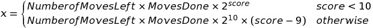

# Neural Net plays Snake

# If you would like to run this project:
You will need to install the program [Processing](https://processing.org/)

# About the Game (If you have never played snake before)
The game consists in a tile (Snake) running around the world trying to survive by eating the red tiles (Food) that pops up each time the Snake eats one. As the snake eats it grows by one tile.

The game will end when the snake dies, by colliding with the wall, or by eating itself.

# The Neural Net
## Struct
  - 4 Layers
    1. Input Layer 24 Entries (Snake Vision)
    2. 2 Hidden Layers with size 16
    3. Output Layer (4 Directions)

## Snake
The snake is able to see in all the 8 directions around her. And isl be able to spot in each diretion if there is food, wall or her body.
    
So the snake Vision can be represented as a bolean matrix of 8 Columns X 3 Rows. Where each row represents one thing that the snake should be looking for, and the sum of each column must be 1.

## Fitness
The Fitness equation is the following

# Extra
If you try to save a file the extension .CSV must be added and the end of the file name.

The Save function saves the best snake's weight matrix values of the current generation to play.
